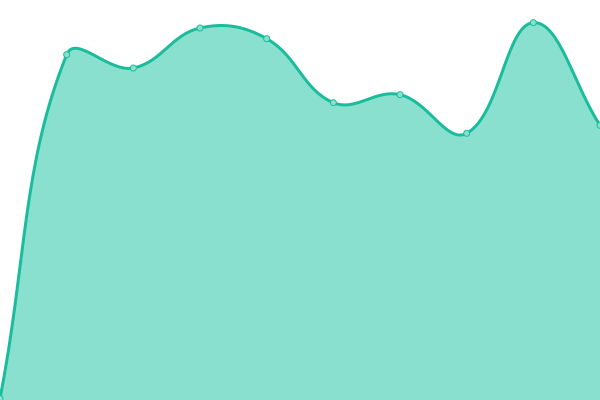
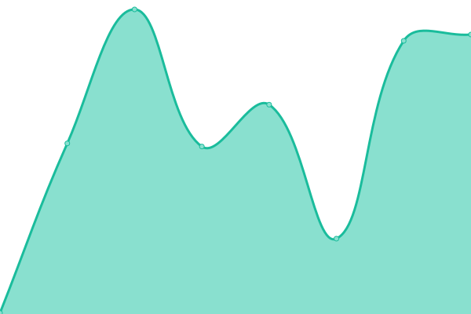
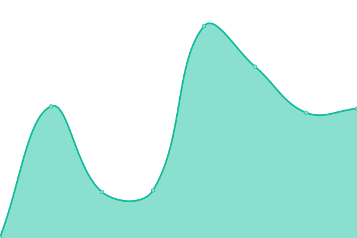
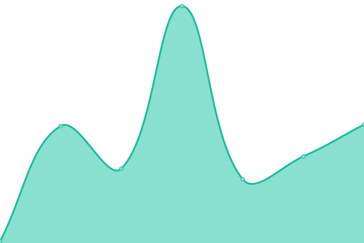

# [📈 Live Status](https://status.codecho.top): <!--live status--> **🟧 Partial outage**

This repository contains the open-source uptime monitor and status page for [Gentleman.Hu](https://crushing.xyz), powered by [Upptime](https://github.com/upptime/upptime).

With [Upptime](https://upptime.js.org), you can get your own unlimited and free uptime monitor and status page, powered entirely by a GitHub repository. We use [Issues](https://github.com/GentlemanHu/own-status/issues) as incident reports, [Actions](https://github.com/GentlemanHu/own-status/actions) as uptime monitors, and [Pages](https://status.codecho.top) for the status page.

<!--start: status pages-->
<!-- This summary is generated by Upptime (https://github.com/upptime/upptime) -->
<!-- Do not edit this manually, your changes will be overwritten -->
<!-- prettier-ignore -->
| URL | Status | History | Response Time | Uptime |
| --- | ------ | ------- | ------------- | ------ |
|  [Keep Pie](https://pie.keepfuture.live) | 🟩 Up | [keep-pie.yml](https://github.com/GentlemanHu/own-status/commits/HEAD/history/keep-pie.yml) | 

 949ms
     
 | 

<a href="https://status.codecho.top/history/keep-pie">100.00%</a>
    

|  [Vps Status](https://status.devfly.top) | 🟩 Up | [vps-status.yml](https://github.com/GentlemanHu/own-status/commits/HEAD/history/vps-status.yml) | 

 642ms
     
 | 

<a href="https://status.codecho.top/history/vps-status">100.00%</a>
    

|  [OwnCloud API](https://api.justfeeling.me) | 🟩 Up | [own-cloud-api.yml](https://github.com/GentlemanHu/own-status/commits/HEAD/history/own-cloud-api.yml) | 

 218ms
     
 | 

<a href="https://status.codecho.top/history/own-cloud-api">100.00%</a>
    

|  [RestCloud API](https://api.crushing.xyz/api/v1/test/template) | 🟩 Up | [rest-cloud-api.yml](https://github.com/GentlemanHu/own-status/commits/HEAD/history/rest-cloud-api.yml) | 

 343ms
     
 | 

<a href="https://status.codecho.top/history/rest-cloud-api">100.00%</a>
    

|  [Book Library](https://book.crushing.xyz) | 🟩 Up | [book-library.yml](https://github.com/GentlemanHu/own-status/commits/HEAD/history/book-library.yml) | 

 828ms
     
 | 

<a href="https://status.codecho.top/history/book-library">100.00%</a>
    

|  [OneDrive](https://pan.devfly.top) | 🟩 Up | [one-drive.yml](https://github.com/GentlemanHu/own-status/commits/HEAD/history/one-drive.yml) | 

 1569ms
     
 | 

<a href="https://status.codecho.top/history/one-drive">100.00%</a>
    

|  [Own VSCode](https://code.crushing.xyz) | 🟩 Up | [own-vs-code.yml](https://github.com/GentlemanHu/own-status/commits/HEAD/history/own-vs-code.yml) | 

 319ms
     
 | 

<a href="https://status.codecho.top/history/own-vs-code">100.00%</a>
    

|  [Own IDE](https://ide.crushing.xyz) | 🟥 Down | [own-ide.yml](https://github.com/GentlemanHu/own-status/commits/HEAD/history/own-ide.yml) | 

 221ms
     
 | 

<a href="https://status.codecho.top/history/own-ide">0.00%</a>
    

|  [Own OS](https://os.crushing.xyz) | 🟩 Up | [own-os.yml](https://github.com/GentlemanHu/own-status/commits/HEAD/history/own-os.yml) | 

 860ms
     
 | 

<a href="https://status.codecho.top/history/own-os">100.00%</a>
    

|  [Portainer](https://get.crushing.xyz) | 🟩 Up | [portainer.yml](https://github.com/GentlemanHu/own-status/commits/HEAD/history/portainer.yml) | 

 256ms
     
 | 

<a href="https://status.codecho.top/history/portainer">100.00%</a>
    

|  [Monit](https://monit.devfly.top) | 🟩 Up | [monit.yml](https://github.com/GentlemanHu/own-status/commits/HEAD/history/monit.yml) | 

 490ms
     
 | 

<a href="https://status.codecho.top/history/monit">100.00%</a>
    

|  [Blog xyz](https://blog.crushing.xyz) | 🟩 Up | [blog-xyz.yml](https://github.com/GentlemanHu/own-status/commits/HEAD/history/blog-xyz.yml) | 

 93ms
     
 | 

<a href="https://status.codecho.top/history/blog-xyz">100.00%</a>
    

|  [Read xyz](https://read.crushing.xyz) | 🟩 Up | [read-xyz.yml](https://github.com/GentlemanHu/own-status/commits/HEAD/history/read-xyz.yml) | 

 588ms
     
 | 

<a href="https://status.codecho.top/history/read-xyz">100.00%</a>
    

|  [WWWW xyz](https://www.crushing.xyz) | 🟩 Up | [wwww-xyz.yml](https://github.com/GentlemanHu/own-status/commits/HEAD/history/wwww-xyz.yml) | 

 2486ms
     
 | 

<a href="https://status.codecho.top/history/wwww-xyz">99.66%</a>
    

|  [Note](https://note.justfeeling.me) | 🟩 Up | [note.yml](https://github.com/GentlemanHu/own-status/commits/HEAD/history/note.yml) | 

 212ms
     
 | 

<a href="https://status.codecho.top/history/note">100.00%</a>
    

|  [Cloud60 Code](https://vscode.devfly.top) | 🟩 Up | [cloud60-code.yml](https://github.com/GentlemanHu/own-status/commits/HEAD/history/cloud60-code.yml) | 

 740ms
     
 | 

<a href="https://status.codecho.top/history/cloud60-code">100.00%</a>
    

|  [Jupyter Lab](https://lab.devfly.top) | 🟩 Up | [jupyter-lab.yml](https://github.com/GentlemanHu/own-status/commits/HEAD/history/jupyter-lab.yml) | 

 870ms
     
 | 

<a href="https://status.codecho.top/history/jupyter-lab">100.00%</a>
    

|  [GD-TG bot](https://bot.devfly.top/api/gdurl/count) | 🟩 Up | [gd-tg-bot.yml](https://github.com/GentlemanHu/own-status/commits/HEAD/history/gd-tg-bot.yml) | 

 664ms
     
 | 

<a href="https://status.codecho.top/history/gd-tg-bot">100.00%</a>
    

<!--end: status pages-->

[**Visit our status website →**](https://status.codecho.top)

## 📄 License

- Powered by: [Upptime](https://github.com/upptime/upptime)
- Code: [MIT](./LICENSE) © [Gentleman.Hu](https://crushing.xyz)
- Data in the `./history` directory: [Open Database License](https://opendatacommons.org/licenses/odbl/1-0/)
