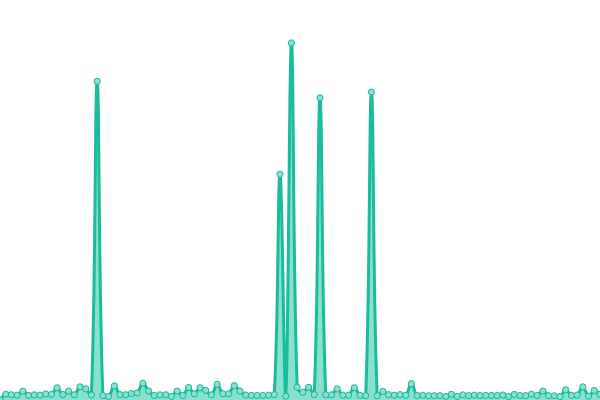

# [📈 Live Status](https://status.codecho.top): <!--live status--> **🟧 Partial outage**

This repository contains the open-source uptime monitor and status page for [Gentleman.Hu](https://crushing.xyz), powered by [Upptime](https://github.com/upptime/upptime).

With [Upptime](https://upptime.js.org), you can get your own unlimited and free uptime monitor and status page, powered entirely by a GitHub repository. We use [Issues](https://github.com/GentlemanHu/own-status/issues) as incident reports, [Actions](https://github.com/GentlemanHu/own-status/actions) as uptime monitors, and [Pages](https://status.codecho.top) for the status page.

<!--start: status pages-->
<!-- This summary is generated by Upptime (https://github.com/upptime/upptime) -->
<!-- Do not edit this manually, your changes will be overwritten -->
<!-- prettier-ignore -->
| URL | Status | History | Response Time | Uptime |
| --- | ------ | ------- | ------------- | ------ |
|  [Book Library](https://store.crushing.xyz) | 🟩 Up | [book-library.yml](https://github.com/GentlemanHu/own-status/commits/HEAD/history/book-library.yml) | 

 2503ms
     
 | 

<a href="https://up.crushing.xyz/history/book-library">100.00%</a>
    

|  [Own Cloud Drivers](https://yun.crushing.xyz) | 🟩 Up | [own-cloud-drivers.yml](https://github.com/GentlemanHu/own-status/commits/HEAD/history/own-cloud-drivers.yml) | 

 3059ms
     
 | 

<a href="https://up.crushing.xyz/history/own-cloud-drivers">100.00%</a>
    

|  [Blog xyz](https://blog.crushing.xyz) | 🟩 Up | [blog-xyz.yml](https://github.com/GentlemanHu/own-status/commits/HEAD/history/blog-xyz.yml) | 

 88ms
     
 | 

<a href="https://up.crushing.xyz/history/blog-xyz">100.00%</a>
    

|  [Read xyz](https://read.crushing.xyz) | 🟩 Up | [read-xyz.yml](https://github.com/GentlemanHu/own-status/commits/HEAD/history/read-xyz.yml) | 

 1294ms
     
 | 

<a href="https://up.crushing.xyz/history/read-xyz">100.00%</a>
    

|  [WWWW xyz](https://www.crushing.xyz) | 🟩 Up | [wwww-xyz.yml](https://github.com/GentlemanHu/own-status/commits/HEAD/history/wwww-xyz.yml) | 

 2552ms
     
 | 

<a href="https://up.crushing.xyz/history/wwww-xyz">100.00%</a>
    

|  [Jupyter Lab](https://jupyter.crushing.xyz) | 🟩 Up | [jupyter-lab.yml](https://github.com/GentlemanHu/own-status/commits/HEAD/history/jupyter-lab.yml) | 

 802ms
     
 | 

<a href="https://up.crushing.xyz/history/jupyter-lab">100.00%</a>
    

|  [AI flowise](https://aiflow.crushing.xyz) | 🟩 Up | [ai-flowise.yml](https://github.com/GentlemanHu/own-status/commits/HEAD/history/ai-flowise.yml) | 

 3541ms
     
 | 

<a href="https://up.crushing.xyz/history/ai-flowise">93.91%</a>
    

|  [Local Stable Diffusion](https://sd.crushing.xyz) | 🟥 Down | [local-stable-diffusion.yml](https://github.com/GentlemanHu/own-status/commits/HEAD/history/local-stable-diffusion.yml) | 

 685ms
     
 | 

<a href="https://up.crushing.xyz/history/local-stable-diffusion">0.00%</a>
    

|  [ChatGPT Next](https://gpt.crushing.xyz) | 🟩 Up | [chat-gpt-next.yml](https://github.com/GentlemanHu/own-status/commits/HEAD/history/chat-gpt-next.yml) | 

 134ms
     
 | 

<a href="https://up.crushing.xyz/history/chat-gpt-next">100.00%</a>
    

|  [DeepL](https://deepl.crushing.xyz/translate) | 🟥 Down | [deep-l.yml](https://github.com/GentlemanHu/own-status/commits/HEAD/history/deep-l.yml) | 

 693ms
     
 | 

<a href="https://up.crushing.xyz/history/deep-l">0.00%</a>
    

|  [WeChat Blog](https://ai.crushing.xyz) | 🟩 Up | [we-chat-blog.yml](https://github.com/GentlemanHu/own-status/commits/HEAD/history/we-chat-blog.yml) | 

 2127ms
     
 | 

<a href="https://up.crushing.xyz/history/we-chat-blog">99.77%</a>
    

|  [Home](https://home.crushing.xyz) | 🟩 Up | [home.yml](https://github.com/GentlemanHu/own-status/commits/HEAD/history/home.yml) | 

 682ms
     
 | 

<a href="https://up.crushing.xyz/history/home">100.00%</a>
    

<!--end: status pages-->

[**Visit our status website →**](https://status.codecho.top)

## 📄 License

- Powered by: [Upptime](https://github.com/upptime/upptime)
- Code: [MIT](./LICENSE) © [Gentleman.Hu](https://crushing.xyz)
- Data in the `./history` directory: [Open Database License](https://opendatacommons.org/licenses/odbl/1-0/)
